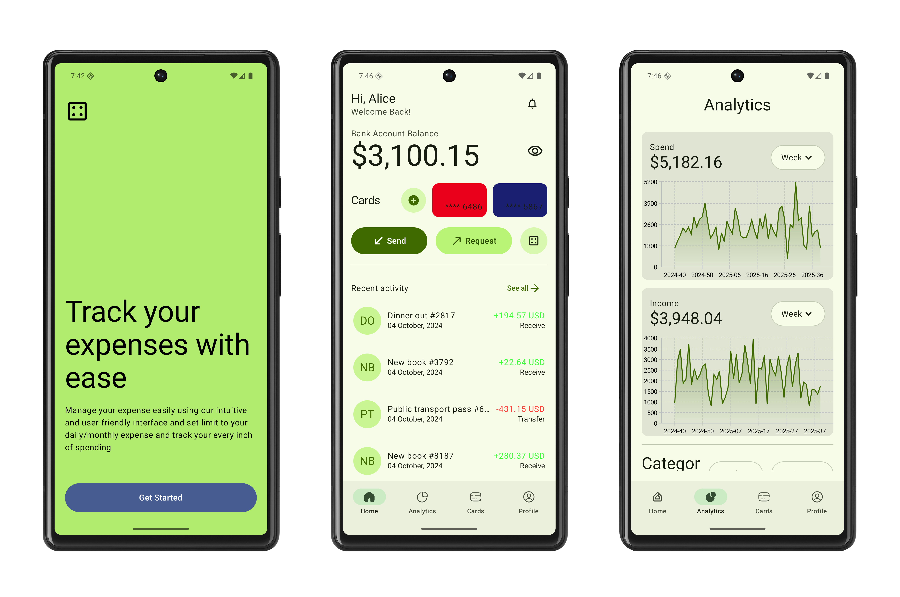

# Expense Tracker - Modern Android App

A modern, offline-first Android application designed to help you manage your personal finances with ease. Track your expenses and income, categorize your transactions, and visualize your spending habits through insightful charts.

## ✨ Features

* Track Transactions: Easily add, edit, and delete your daily expenses and income.
* Categorization: Assign categories to your transactions to understand where your money goes.
* Multiple Accounts: Manage finances across different accounts like a bank, wallet, or credit cards.
* Intuitive UI: A clean, card-based interface for a seamless user experience.
* Data Visualization:
    * Bar Graphs: Compare your spending over different periods.
    * Pie Charts: See a breakdown of your expenses by category.
* 100% Offline: All your financial data is stored securely on your device, ensuring privacy and accessibility without an internet connection.
* Efficient Data Handling: Smoothly scroll through a long history of transactions without performance issues.

## 🛠️ Tech Stack & Architecture

This project is built with a modern Android tech stack, focusing on performance, scalability, and maintainability.

* Language: Kotlin
* Architecture: MVVM (Model-View-ViewModel)
* * **UI:** 100% [Jetpack Compose](https://developer.android.com/jetpack/compose) for a declarative and modern UI.
* **Architecture:** Follows the official "Guide to App Architecture".
  * **UI Layer:** Composable and ViewModels.
  * **Domain Layer:** (Optional) Use cases for complex business logic.
  * **Data Layer:** Repositories and Data Sources (Room & MediaStore).
* **Asynchronous Programming:** [Kotlin Coroutines](https://kotlinlang.org/docs/coroutines-overview.html) and [Flow](https://kotlinlang.org/docs/flow.html) for managing background tasks and data streams.
* **Dependency Injection:** [Hilt](https://developer.android.com/training/dependency-injection/hilt-android) for managing dependencies throughout the app.
* **Database:** [Room](https://developer.android.com/training/data-storage/room) for robust, offline caching of all music metadata.
* **Pagination:** [Jetpack Paging 3](https://developer.android.com/topic/libraries/architecture/paging/v3-overview) for efficiently loading and displaying large lists of songs.
* **Charting Library:** [Vico](https://github.com/patrykandpatrick/vico) a powerful charting library to render bar charts.
* *

## 📸 Screenshots

### Light Mode

### Dark Mode

## 🚀 Getting Started

To build and run this project, follow these steps:

* Clone the repository: `git clone https://github.com/dontknow492/ExpenseTracker.git`
* Open in Android Studio:
    * Open Android Studio.
    * Select File > Open and navigate to the cloned project directory.
* Build the project:
    * Let Android Studio sync the Gradle files.
    * Click the Run 'app' button or use the Shift + F10 shortcut.

## 🤝 Contributing

Contributions are welcome! If you have ideas for improvements or find any bugs, feel free to open an issue or submit a pull request.

1. Fork the Project
2. Create your Feature Branch (`git checkout -b feature/NewFeature`)
3. Commit your Changes (`git commit -m 'Add some NewFeature'`)
4. Push to the Branch (`git push origin feature/NewFeature`)
5. Open a Pull Request

## 📄 License

This project is licensed under the MIT License - see the LICENSE.md file for details.
